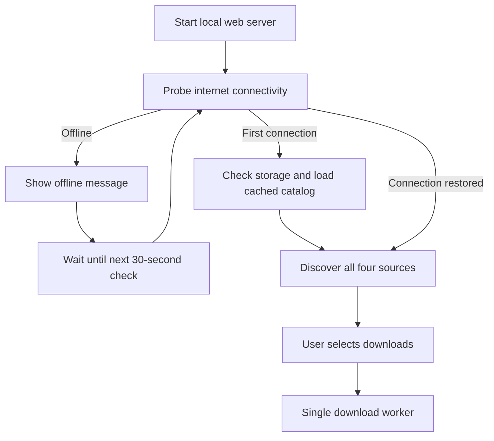

# Data Download development guide

This guide describes the Python implementation in `data_download`. For building,
running, and operating the container, start with the [README](../README.md).
The [API reference](API.md) documents browser requests and data structures;
the [testing guide](TESTING.md) covers automated and Raspberry Pi checks.

## Programs and files

| File | Responsibility | How it runs |
| --- | --- | --- |
| [app.py](../app.py) | HTTP server, connectivity lifecycle, storage checks, queue, downloads, validation, and extraction | Container entrypoint: `python3 /opt/data_download/app.py` |
| [routing.py](../routing.py) | Verified routing receipts, pending selection, atomic activation after GraphHopper stops | Imported by `app.py`; boot CLI: `python3 /opt/data_download/routing.py` |
| [sources.py](../sources.py) | HTTPS connectivity probes and catalog discovery for four sources | Imported by `app.py`; no standalone command |
| [tests/test_downloader.py](../tests/test_downloader.py) | Offline regression tests and loopback HTTP tests | `python3 -m unittest discover -s tests -v` |
| [static/app.js](../static/app.js) | Browser state polling, search, selection, and job controls | Loaded by the served page |
| [static/index.html](../static/index.html), [static/style.css](../static/style.css) | Page structure and Library website colors | Served as fixed local assets |
| [Containerfile](../Containerfile), [compose.yaml](../compose.yaml) | Image build, bind mount, port publication, and Compose healthcheck | Podman / Compose |

The Python implementation uses only the standard library. Importing either
production module does not start services, read the catalog, or make requests.
The default container uses Debian Trixie's Python; tests have also run under
Python 3.12 on the development host.

## Startup and connectivity

The entrypoint creates `Storage`, `Application`, and a `ThreadingHTTPServer`
bound to `0.0.0.0:4286`. The HTTP listener is available while background startup
work proceeds. `Application.start()` starts one download worker and an internet
monitor; the worker waits on an initially empty queue.



`sources.internet_available()` sends HTTPS HEAD requests to GitHub, Wikimedia
dumps, Survivor Library, then Geofabrik, stopping at the first reachable host. Each request
uses a five-second timeout. An HTTP error such as 429 or 503 still establishes
connectivity. DNS, connection, and TLS failures do not. Responses redirected to
another hostname are not accepted as evidence of connectivity.

The monitor probes immediately, then subtracts probe time from a 30-second
interval using `time.monotonic()`. While offline the exact message is:

> No Internet, its really hard to go on like this

The first successful check initializes storage reporting and loads cached rows.
Until then, `/api/state` reports storage as waiting. Discovery starts after that
first connection, and is requested again on an offline-to-online transition.
An already-running scan is not duplicated. Internet checks continue while online.

The probe is a practical source-host reachability check, not proof that every
download works. A source can be rate-limited or a particular object unavailable
while the internet status remains online. Manual refresh and new download
requests are gated while offline. Existing jobs are not automatically paused or
resumed by the monitor; network errors become retryable job failures.

## Threads and shared state

| Worker | Purpose |
| --- | --- |
| HTTP request threads | Serve local assets and read or mutate application state |
| `internet-monitor` | Probe connectivity and trigger startup/recovery discovery |
| `catalog-discovery` | Start a scan per source and persist the resulting catalog |
| Source scan threads | Independently discover maps, routing extracts, Wikipedia, and Survivor ZIPs |
| Source thread pools | Up to four simultaneous map-pointer or category-page requests per source |
| `download-worker` | Process one queued file at a time |

`Application.lock` is a reentrant lock protecting shared catalogs, source status,
jobs, and connectivity state. Discovery publishes batches under the lock so rows
can appear before all categories finish. Queue submissions copy catalog rows;
a later refresh does not change the metadata of an already-queued transfer.
Each job has a cancellation `threading.Event`.

Call `start()` once per application. SIGTERM and Ctrl-C stop the monitor, set job
cancellation events, and close the HTTP server. Background threads are daemons;
shutdown does not wait for all downloads or extraction to finish. Partial files
can remain for later retry, and interrupted extraction can leave a staging folder.

## Source discovery in sources.py

`discover(source, publish)` accepts `maps`, `routing`, `wiki`, or `survivor`. Its callback
receives lists of normalized catalog dictionaries. It returns an empty string
on success or a warning for child-listing failures. Initial network/listing
failures propagate to the application, which records a source error.

| Source | Discovery method | Size and integrity metadata |
| --- | --- | --- |
| Maps | GitHub contents API for the configured repository's `pmtiles` directory | Entries below 1 KiB are resolved as LFS pointers; their actual size and SHA-256 accompany a GitHub media download URL |
| Routing | Parse current US regional Geofabrik PBF links; HEAD each file and fetch its MD5 sidecar | Exact Content-Length and MD5; a local SHA-256 receipt is saved after verification |
| Wikipedia | Parse ZIM links from the configured directory listing | Parse exact trailing byte counts; missing/unrecognized sizes become `None` |
| Survivor Library | Find same-site `library-*` category pages, then their ZIP links | Sizes remain `None` until transfer; rounded MB labels are not treated as exact byte counts |

`Links` deliberately captures text following an anchor until the next anchor,
including timestamps and sizes outside `</a>`. It tolerates the malformed,
unquoted ZIP anchors found in category pages. It is not a general HTML DOM parser.

`fetch()` limits metadata to 8 MiB by default. LFS pointer reads use a 2 KiB limit.
`open_url()` requests identity encoding and a 30-second timeout. No PMTiles, ZIM,
or ZIP archive is downloaded during catalog discovery.

Successful scans remove stale rows for that source. Partial/failed scans retain
previous rows alongside fresh ones. Each source reports its own outcome, so one
failed site does not discard another site's catalog. The row contract is in
[API.md](API.md#catalog-rows).

## Storage and publication in app.py

`Storage.check()` verifies that the configured root exists, is writable, and,
normally, is a mount point. A container bind mount satisfies that last check;
the operator must also verify the host `/Library` is the USB filesystem before
starting the container. `Storage.path()` rejects parent traversal, absolute
paths, existing symlinks, and existing components on another filesystem.

`Storage.space(needed)` requires `needed + reserve <= free`. The default reserve
is 256 MiB. Known remaining transfer sizes are checked before downloading, and
free space is checked before each 1 MiB write. This is a current-space check, not
a reservation against writes from other applications. The queue does not reserve
space for all its jobs in advance.

The worker moves through these stages:

1. **Queued:** validate catalog IDs, connectivity, and destination existence.
2. **Downloading:** stream into a `.part` file under `.data_download`.
3. **Verifying:** check known length and file signature; hash maps when a source
   SHA-256 is available. ZIM validation is a header/size check, not a full ZIM audit.
4. **Extracting (Survivor only):** validate ZIP paths, entry count, duplicate PDF
   paths, and expanded PDF sizes. Extract only `.pdf` members, reading each to EOF
   to check its ZIP CRC. PDF contents are not separately parsed or authenticated.
5. **Complete:** rename the validated file or staged category to its destination.
   For ZIPs, delete the compressed archive after publishing the PDFs.

Failures and cancellations become terminal job states shown in the browser.
An existing destination is refused instead of intentionally replaced. Staging
and destination share a filesystem so the final rename makes the completed item
visible at once. This does not provide a transaction across multiple jobs or a
guarantee against power loss or other programs concurrently changing the drive.

## Persistent files and retries

```text
/Library/
├── .data_download/
│   ├── catalog.json          # Normalized catalog rows
│   ├── <id>.part             # Partial or completed transfer awaiting publication
│   ├── <id>.json             # URL, total, ETag and/or Last-Modified
│   └── extract-<random>/     # Temporary PDF extraction directory
├── maps/pmtiles/<file>.pmtiles
├── wiki/<file>.zim
└── library/<ZIP-name>/<PDF paths>
```

IDs are the first 24 hex characters of SHA-256 over `source + ':' + url`. They
identify the source URL, not an immutable content version. JSON updates use a
sibling `.tmp` followed by replacement. Jobs/history, cancellation events, and
the browser request token are held only in memory.

Resume requires the same URL and a stored strong ETag or Last-Modified value.
The next request sends `Range` and `If-Range`. A valid 206 appends at the expected
offset; a 200 truncates and restarts. Invalid ranges, inconsistent lengths, or a
changed returned validator produce errors. A known-complete partial with a
stored validator can proceed directly to verification/extraction without another
request. Without a usable validator, a retry starts over.

Transfer errors/cancellation normally retain partial data. Format/checksum
failures remove invalid transfers; `BadZipFile` during extraction also removes
the corrupt ZIP. Ordinary extraction errors remove the temporary extraction
directory but retain the archive. A hard stop can leave `extract-*` directories;
see the [README cleanup guidance](../README.md#space-and-integrity).

## Making changes

Keep catalog-specific parsing in `sources.py` and transfer/storage logic in
`app.py`. Use catalog IDs at the HTTP boundary; do not introduce arbitrary URL
or filesystem-path download inputs. Update the [API reference](API.md) if row
fields, states, or endpoints change, and the [testing guide](TESTING.md) when
coverage changes. Python docstrings describe the function-level contracts.

The frontend fetches state every 2.5 seconds and periodically fetches the catalog;
while discovery is active it fetches the catalog each poll. UI text is inserted
using text nodes rather than interpolating remote names as HTML.

After a poll reports successful downloads and no active jobs, the frontend opens
a restart-reminder dialog. A page-local set of acknowledged completion IDs keeps
it from reopening on every poll. New successful batches trigger another reminder;
failures/cancellations alone do not. Reopening the page can show the reminder for
completed jobs still held by the server. The dialog only reminds the user to shut
down and restart the Library; it does not call a shutdown endpoint.

This service is currently started manually. Adding automatic Library startup or
navigation integration requires separate changes to the appliance's playbooks
and service configuration; adding a Containerfile alone only enables the existing
build/export scripts to discover the image.

## Routing selection and activation

Routing discovery reads Geofabrik's US overview, accepts only current regional
HTTPS PBF links on its host, and uses at most four workers to fetch HEAD sizes
and MD5 sidecars. Files download through the same resumable queue. Verification
checks an OSMHeader blob signature and MD5, computing a local SHA-256 receipt
alongside it. This is transfer/header verification, not a full OSM parser.

`routing.Routing` uses the existing `Storage` policy for all paths. Completed
files get `.osm.pbf.json` receipts. `POST /api/routing` saves or cancels
`maps/osm/routing-pending.json`; an `flock` serializes requests with boot activation.
The web application never stops containers or edits the active graph.

Before routing detection, `start_library.yml` checks for a pending request,
requires the downloader and GraphHopper images, stops GraphHopper, and runs the
helper from the downloader image without network access. The helper checks free
space, stages a second copy, verifies SHA-256, removes the graph completion marker,
then atomically replaces `region.osm.pbf`. Boot then clears the derived cache and
starts GraphHopper to import. Failed copies or verification preserve the previous
active file and pending request. CLI failures are shown via `routing-error.txt`.
`routing-active.json` records the chosen region, not the routing engine's readiness.

The graph cache under `/Library/maps/graph-cache` is owned by the appliance
playbook. Standalone Compose can use a different cache path and should use the
manual setup in [ROUTING.md](ROUTING.md). Routing activation requires an updated
playbook on existing appliances, not just an updated downloader image.
